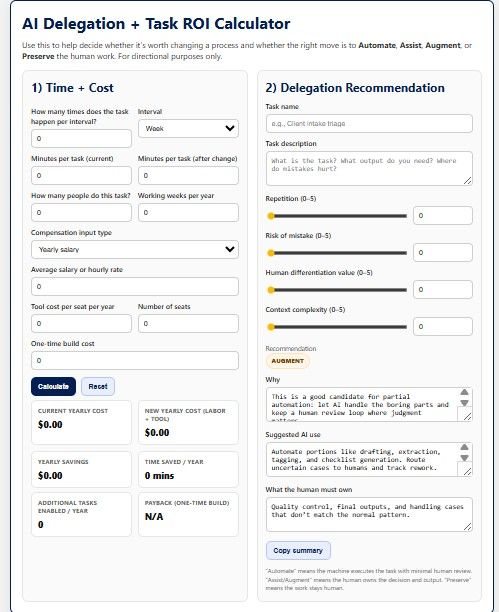

# AI Workflow Value Calculator

This project explores a simple framework for estimating the value of AI automation in operational workflows.

The calculator models potential savings based on:

• number of tasks
• time required per task
• percentage that can be automated
• labor cost

## Live Version

Try the calculator here:

👉 https://legalytical.com/me-or-the-machine%3F

## Why I Built This

When evaluating AI systems, organizations often struggle to quantify the value of automation. This prototype explores a simple model for estimating potential time and cost savings.

## Future Improvements

• scenario comparison
• workflow benchmarking
• integration with operational analytics

## Inputs

- number of tasks
- time required per task
- percent automatable
- hourly labor cost

## Output

- estimated time saved
- estimated cost savings
- recommended delegation approach
